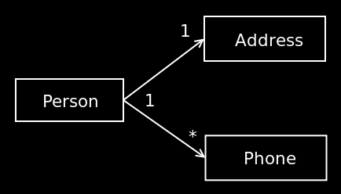
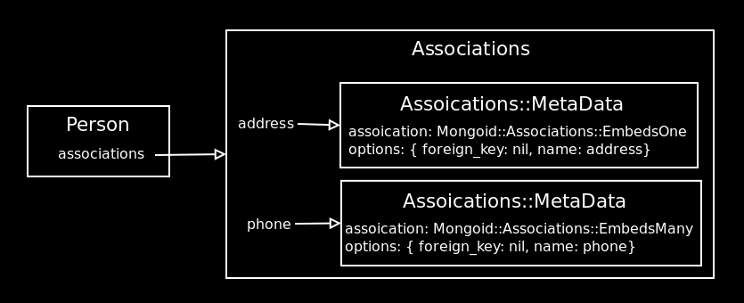
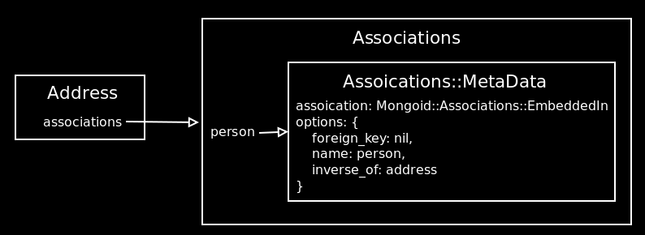
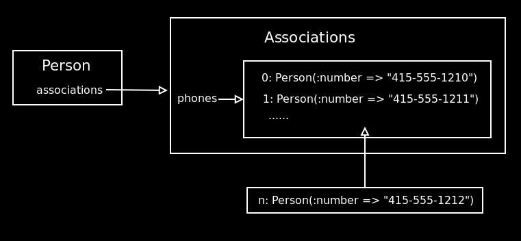

!SLIDE

# Associations #

!SLIDE center

!SLIDE smaller

    @@@Ruby
    class Person
      include Mongoid::Document
      embeds_one :address
      embeds_many :phones
    end

    class Address
      include Mongoid::Document
      embedded_in :person, :inverse_of => :address
    end

    class Phone
      include Mongoid::Document
      embedded_in :person, :inverse_of => :phones
    end

!SLIDE center

!SLIDE center

!SLIDE center

!SLIDE smaller

# Implementation #

    @@@Ruby
    define_method(assoication_name) do
      memoized(association_name) do
        ......
      end
    end

    define_method("#{association_name}=") do |object|
      unmemoize(association_name)
      memoized(association_name) do
        ......
      end
    end

!SLIDE

# Build and create association #

!SLIDE smaller

# embeds_one #

    @@@Ruby
    person = Person.new

    person.build_address(:street => "Oxford Street")
    person.create_address(:street => "Oxford Street")

!SLIDE smallest

    @@@Ruby
    define_method("build_#{association_name}") do |*params|
      attrs = params[0]
      attr_options = params[1] || {}
      reset(name) do
        proxy = type.new(self, options)
        proxy.build((attrs || {}).stringify_keys)
        proxy
      end
    end

!SLIDE smallest

# embeds_many #

    @@@Ruby
    person = Person.new

    person.phones.build(:number => "415-555-1212")
    person.phones.create(:number => "415-555-1212")
    person.phones << Phone.new(:number => "415-555-1212")
    person.phones = [ Phone.new(:number => "415-555-1212") ]

!SLIDE bullets center smaller

* build with unsaved document
* create with saved document

!SLIDE

# Relational Associations #

!SLIDE smaller

    @@@Ruby
    class Person
      include Mongoid::Document
      references_one :policy
      references_many :prescriptions
      references_many :preferences, 
                      :stored_as => :array, 
                      :inverse_of => :people
    end
    class Policy
      include Mongoid::Document
      referenced_in :person
    end
    class Prescription
      include Mongoid::Document
      referenced_in :person
    end
    class Preference
      include Mongoid::Document
      references_many :people, 
                      :stored_as => :array, 
                      :inverse_of => :preferences
    end

!SLIDE smaller

## references are similar to associations in ActiveRecord ##

## implementation of references is simliar to embeds ##
