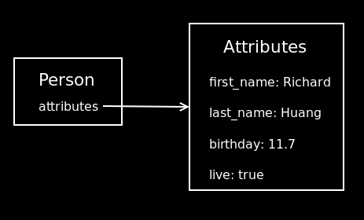

!SLIDE

# Attributes #

!SLIDE center

!SLIDE bullets

# Set and Get for Conversions #

<ul class="float">
<li>Array</li>
<li>BigDecimal</li>
<li>Binary</li>
<li>Boolean</li>
<li>Date</li>
<li>DateTime</li>
<li>Float</li>
<li>Hash</li>
<li>Integer</li>
<li>Object</li>
<li>ObjectId</li>
<li>Set</li>
<li>String</li>
<li>Symbol</li>
</ul>
