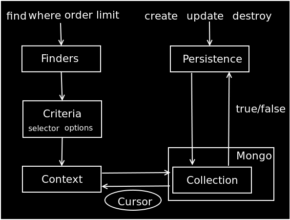

!SLIDE

# Mongodb #

## The Best Features of Document Databases, Key-Value Stores, and RDBMSes. ##

!SLIDE

# Mongoid #

## Mongoid provides an elegant way to persist and query Ruby objects to documents in MongoDB. ##

!SLIDE center

!SLIDE center

# Overview #

!SLIDE

# Document #

    @@@ Ruby
    class Person
      include Mongoid::Document
      field :first_name
      field :middle_initial
      field :last_name
      field :birthday, :type => Date
      field :blood_alcohol_level,
            :type => Float, 
            :default => 0.0
    end

!SLIDE

## include Mongoid::Document means ##

## You get the CRUD ability to Mongodb ##
