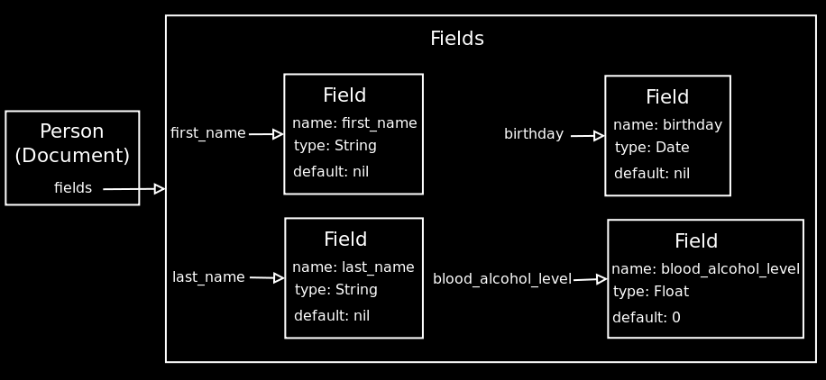

!SLIDE

# Fields #

!SLIDE

!SLIDE

# Getter method #

    @@@ Ruby
    person.first_name
    person.last_name

!SLIDE

# Getter method #

    @@@ Ruby
    define_method(meth) {
      read_attribute(name)
    }

!SLIDE

# Setter method #

    @@@ Ruby
    person.first_name = "Richard"
    person.last_name = "Huang"

!SLIDE

# Setter method #

    @@@ Ruby
    define_method("#{meth}=") { |value|
      write_attribute(name, value)
    }

!SLIDE

# Query method #

    @@@ Ruby
    person.first_name?
    person.last_name?

!SLIDE

# Query method #

    @@@ Ruby
    define_method("#{meth}?") do
      attr = read_attribute(name)
      (options[:type] == Boolean) ? 
        attr == true : 
        attr.present?
    end
