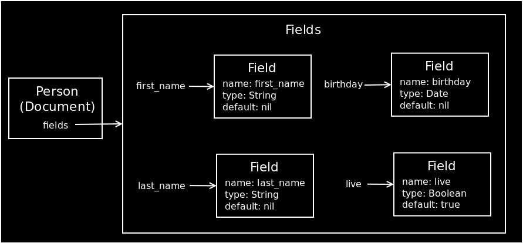

!SLIDE

# Fields #

!SLIDE center

!SLIDE

# field #

    @@@Ruby
    class Person
      include Mongoid::Document
      field :first_name
      field :last_name
    end

## field attribute means ##
## the ability of getter, setter and query attribute ##

!SLIDE

    @@@ Ruby
    person.first_name
    person.last_name

    person.first_name = "Richard"
    person.last_name = "Huang"

    person.first_name?
    person.last_name?

!SLIDE small

# Implementation #

    @@@Ruby
    define_method(meth) { read_attribute(name) }

    define_method("#{meth}=") { |value|
      write_attribute(name, value)
    }

    define_method("#{meth}?") do
      attr = read_attribute(name)
      (options[:type] == Boolean) ?
        attr == true : 
        attr.present?
    end
