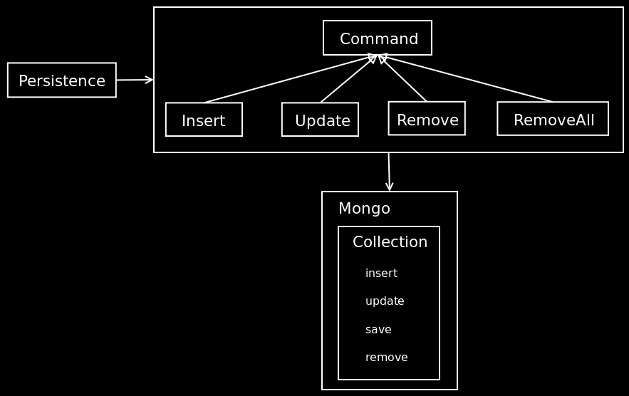

!SLIDE

# Persistence #

!SLIDE

# create #

    @@@Ruby
    person = Person.create(
      :first_name => "Syd", 
      :last_name => "Vicious"
    )
    person = Person.create!(
      :first_name => "Emmanuel", 
      :last_name => "Zorg"
    )

!SLIDE

# save #

    @@@Ruby
    person = Person.new(
      :first_name => "Syd",
      :last_name => "Vicious"
    )
    person.save

    person = Person.new(
      :first_name => "Emmanuel", 
      :last_name => "Zorg"
    )
    person.save!

!SLIDE

# update_attributes #

    @@@Ruby
    person.update_attributes(
      :first_name => "Syd", 
      :last_name => "Vicious"
    )

    person.update_attributes!(
      :first_name => "Emmanuel", 
      :last_name => "Zorg"
    )

!SLIDE small

# destroy #

    @@@Ruby
    person.destroy
    person.delete

    Person.destroy_all(
      :conditions => { 
        :first_name => "Syd", 
        :last_name => "Vicious" 
      }
    )
    Person.delete_all(
      :conditions => { 
        :first_name => "Syd", 
        :last_name => "Vicious" 
      }
    )

!SLIDE

!SLIDE

    @@@Ruby
    def insert(options = {})
      Insert.new(self, options).persist
    end

    def update(options = {})
      Update.new(self, options).persist
    end
