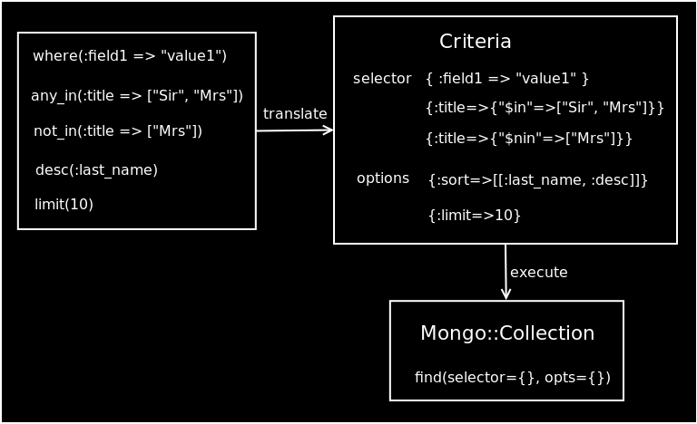
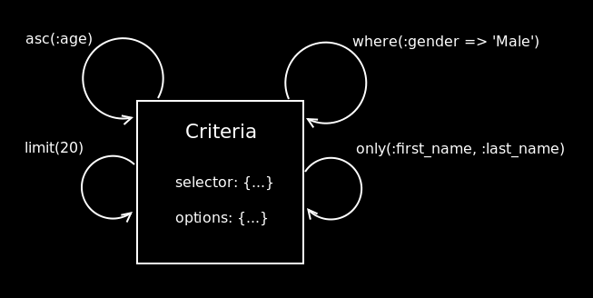
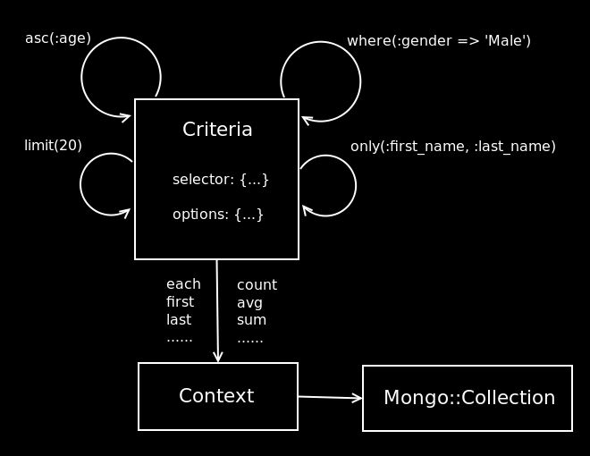
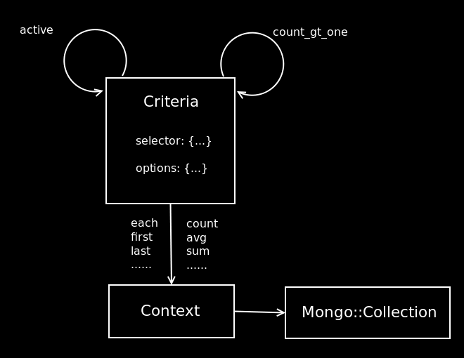

!SLIDE

# Querying #

!SLIDE smaller

# Finders #

    @@@Ruby
    Person.all(:conditions => { :name => "Syd" })
    Person.find(:all, 
                :conditions => { :name => "Syd" })

    Person.first(:conditions => { :name => "Syd" })
    Person.find(:first, 
                :conditions => { :name => "Syd" })

    Person.last(:conditions => { :name => "Syd" })
    Person.find(:last, 
                :conditions => { :name => "Syd" })

!SLIDE smallest

# Finders #

    @@@Ruby
    Person.all_in(:aliases => [ "Jeffrey", "The Dude" ])

    Person.any_in(:status => ["Single", "Divorced", "Separated"])

    Person.any_of({:status => "Single"}, {:preference => "Open"})

    Person.and(:age.gt => 18, :gender => "Male")

    Person.where(:status => "Married").count

    Person.excludes(:status => "Married")

    Person.criteria.id("4b2fe28ee2dc9b5f7b000029")

    Address.near(:position => [ 37.7, -122.4, 10 ])

    Person.not_in(:status => ["Divorced", "Single"])

    Person.only(:first_name, :last_name)

!SLIDE smallest

# Finders #

    @@@Ruby
    Person.desc(:last_name).asc(:first_name)

    Person.descending(:last_name).ascending(:first_name)

    Person.order_by(:last_name.desc, :first_name.asc, :city.desc)

    Person.order_by([[:last_name, :desc], [:first_name, :asc]])

!SLIDE smaller

# Finders #

    @@@Ruby
    Person.limit(20)

    Person.skip(100)

!SLIDE smaller

# Finders #

    @@@Ruby
    Person.where(:age.gt => 18, :gender => "Male")

    Person.where(:last_name => /^Jord/)

    Person.where(:age.gt => 18, :age.lt => 30)

!SLIDE bullets

# Criteria #

* translate
* lazy finders
* chainable scope

!SLIDE center

!SLIDE

# Translate #

!SLIDE smaller

    @@@Ruby
    Person.find(:all, :conditions => {:name => "Syd"})

    selector: { :name => "Syd" }
    options: {}

!SLIDE smaller

    @@@Ruby
    Person.any_in(:status => ["Single", "Married"])

    selector: {:status=>{"$in"=>["Single", "Married"]}}
    options: {}

!SLIDE smallest

    @@@Ruby
    Person.any_of({:status => "Single"}, {:preference => "Open"})

    selector:{"$or"=>[{:status=>"Single"},{:preference=>"Open"}]}
    options: {}

!SLIDE smallest

    @@@Ruby
    Person.desc(:last_name).asc(:first_name)

    selector: {}
    options: {:sort=>[[:last_name, :desc], [:first_name, :desc]]}

!SLIDE small

    @@@Ruby
    Person.limit(20).skip(100)

    selector: {}
    options: {:limit=>20, :skip=> 100}

!SLIDE smaller

    @@@Ruby
    Person.where(:age.gt => 18, :age.lt => 30)

    selector: {}
    options: { :age => [{"$gt" => 18}, { "$lt" => 30 }] }

!SLIDE

# Lazy finders #

!SLIDE center

!SLIDE center

!SLIDE bullets

# query not be executed until #

* each
* first
* last
* count
* ......

!SLIDE

# Chainable scope #

!SLIDE smaller

    @@@Ruby
    class Person
      include Mongoid::Document
      field :active, :type => Boolean
      field :count, :type => Integer
    
      scope :active, :where => { :active => true }
      scope :count_gt_one, :where => { :count.gt => 1 }
    end

!SLIDE smaller

# Implementation #

    @@@Ruby
    def named_scope(name, conditions = {}, &block)
      name = name.to_sym
      scopes[name] = Scope.new(conditions, &block)
      (class << self; self; end).class_eval <<-EOT
        def #{name}(*args)
          scope = scopes[:#{name}]
          scope.extend(
            criteria.fuse(scope.conditions.scoped(*args))
          )
        end
      EOT
    end

!SLIDE center

